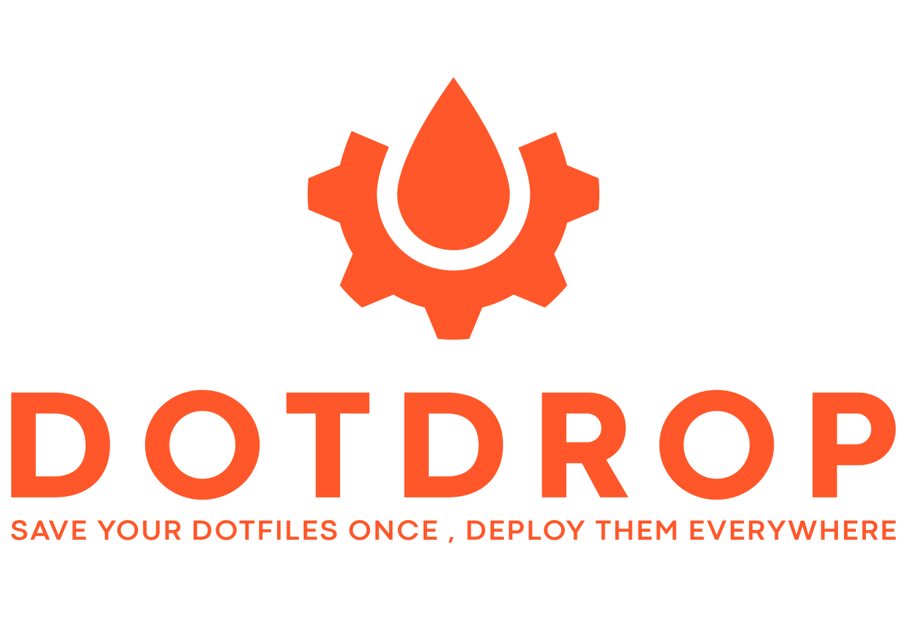

[Dotdrop](https://github.com/deadc0de6/dotdrop) is a dotfiles manager that provides efficient ways of managing your precious config files.
It is especially powerful when it comes to managing those across different hosts.

The main idea of dotdrop is to have the ability to store each dotfile only once and deploy them with a different content on different hosts/setups.
To achieve this, it uses a templating engine that allows to specify, during the dotfile installation with dotdrop, based on a selected profile,
how (with what content) each dotfile will be installed.

Get easily all your dotfiles imported and use dotdrop to manage them

* [✔] **VERSIONED WITH GIT**

  Be it on github, gitlab or your own git solution, git makes
  sure you are able to keep a history of your changes

* [✔] **NO DUPLICATES, EFFICIENT, TEMPLATED**

  Each dotfile is stored only once, dotdrop allows to template your config files
  such that the same dotfile is customized when deployed on the host you're working on

* [✔] **HANDLE MULTIPLE PROFILES WITH MORE GRANULARITY**

  Different profiles can be defined that allows for a fine-grained control over which
  dotfiles has to be installed on different hosts (home, work, vps, etc).
  Some hosts/profiles will have all your dotfiles installed while others might just
  need a subset of the dotfiles

* [✔] **TO SYMLINK OR NOT TO SYMLINK**

  You can choose for each dotfile if you want it to be symlinked or
  directly copied to its final destination

* [✔] **PRE/POST DEPLOYMENT ACTIONS**

  Actions can be executed each time a specific dotfile is installed, for
  example to install a package, setup some directories, call a tool to update, etc

* [✔] **HANDLE SENSITIVE INFORMATION**

  Multiple solutions are available to handle dotfiles containing sensitive information
  as well as fully encrypted dotfiles/rc files

* [✔] **QUICK COMPARE**

  Compare your local dotfiles with the one managed by dotdrop
  to quickly see what changed.

… and much more …

Go check [dotdrop](https://github.com/deadc0de6/dotdrop), it does all that!

For more check

* [The readme](https://github.com/deadc0de6/dotdrop)
* [The documentation](https://dotdrop.readthedocs.io/)
